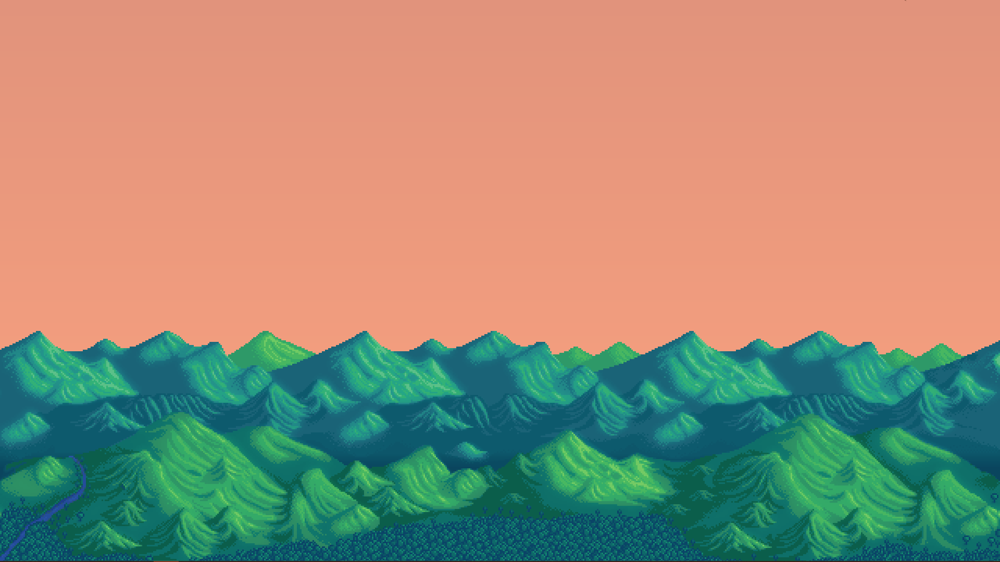
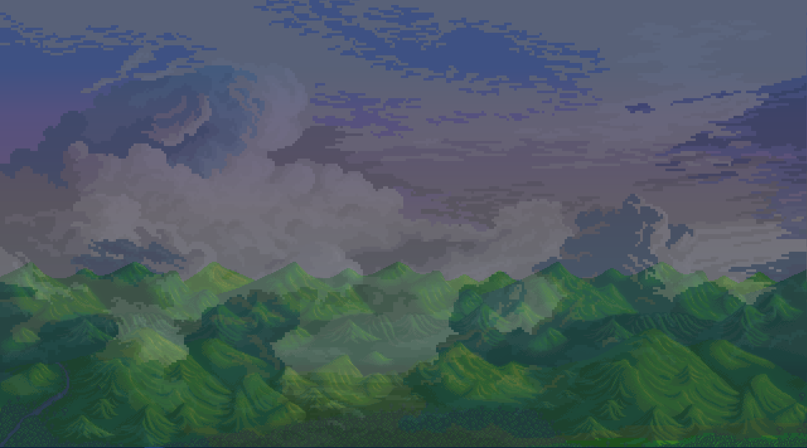
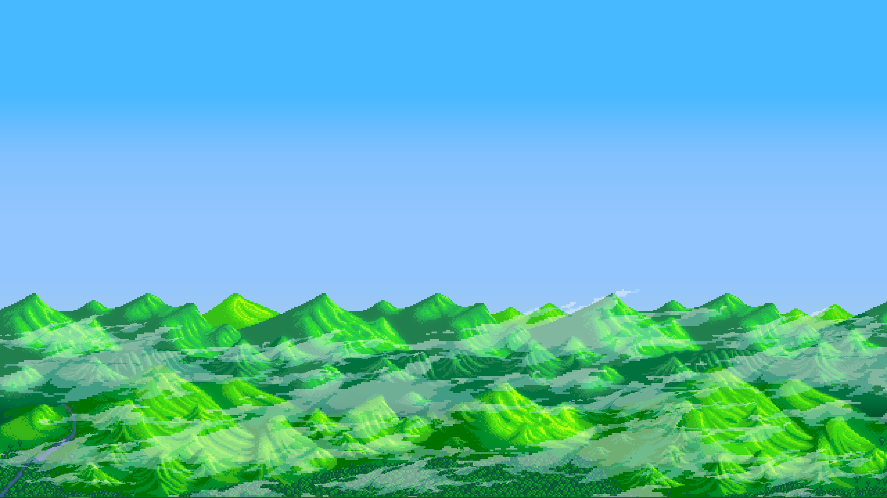

# Dynamic Desktop Background Generator

A Python application that generates dynamic multi-monitor desktop backgrounds using real-world weather, astronomical data, time of day, seasons, and holidays.

The application combines layered artwork with live environmental data to render unique wallpapers that automatically update throughout the day.

This project is actively under development. Current screenshots use temporary artwork while the rendering engine and layering systems continue to evolve.

## Current Features

- Dynamic weather visualization
- Accurate sunrise and sunset timing
- Time-of-day sky transitions
- Seasonal landscape overlays
- Holiday overlays
- Astronomical calculations
- Layered image compositing
- Multi-monitor wallpaper generation
- Automatic wallpaper updates
- Configurable JSON-driven asset pipeline

## Technologies

- Python
- Pillow (PIL)
- OpenWeather API
- JSON configuration
- Windows Task Scheduler

## Engineering Highlights

- Modular rendering architecture
- Multi-monitor rendering pipeline
- Layer-based image compositing
- JSON-driven asset management
- Weather API integration
- Astronomical calculations
- Time-based transition system

## Project Goals

Create a configurable rendering engine that transforms live environmental data into dynamic desktop artwork while emphasizing modular architecture, extensibility, and maintainable rendering pipelines.

## Completed Features

- Dynamic sunrise/sunset timing
- Weather API integration
- Seasonal rendering
- Time-of-day transitions
- Multi-monitor support

## Planned Features

- Moon phases
- Lightning animations
- Shooting stars
- Improved artwork
- Performance optimization

## Screenshots

### Clear Sunrise

### Overcast Afternoon

### Foggy Morning

## Setup

1. Install Python
2. Get OpenWeather API key
3. Set environment variable
4. Create config.json
5. Run scheduler

## Art Credits

Some temporary placeholder artwork is derived from:

- Stardew Valley (landscape and star references)
- Retronator (selected cloud assets)

These assets are placeholders and will be replaced prior to public release.
